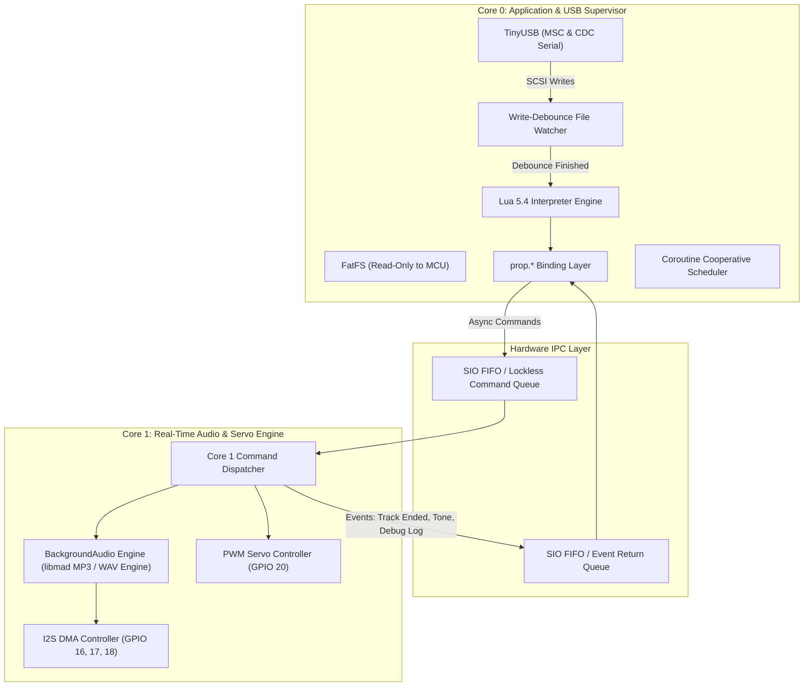
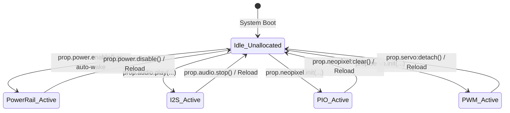

# ezpropkit Technical Engineering Specification

**Document Version:** 1.0.0  
**Target Platform:** Adafruit RP2040 Prop-Maker Feather (Product ID / SKU 5768)  
**Author / Maintainer:** ezpropkit core engineering  

---

## 1. Executive Summary & Goals

`ezpropkit` is an embedded firmware architecture for the Raspberry Pi RP2040 microcontroller on the Adafruit Prop-Maker Feather board. Its goal is to provide costume prop makers and animatronics designers with the friction-free, drag-and-drop workflow pioneered by CircuitPython, but implemented in **Lua 5.4** coupled with a high-performance bare-metal **C audio/peripheral runtime**.

Key objectives:
* **No Toolchain Required for Makers**: The board presents a USB Mass Storage (MSC) volume labeled `EZPROPKIT`. Users drag and drop Lua scripts (`code.lua` or `main.lua`) and audio files (`.wav`, `.mp3`).
* **Instant Hot Reload**: Changes written by the host OS are debounced and automatically trigger a clean peripheral teardown and Lua VM reload without requiring physical reset.
* **Dual-Core Partitioning**: Core 0 executes non-timing-critical tasks (USB device stack, FAT file system, Lua VM). Core 1 executes real-time timing-critical tasks (I2S DMA audio decoding, PIO NeoPixel generation, PWM servo timing).
* **Lazy Initialization**: Zero peripheral hardware initialization overhead until requested by Lua code, minimizing sleep power consumption and SRAM usage.
* **Overclocked & Optimized**: RP2040 runs at 200 MHz system clock with `-O3` compiler optimization.

---

## 2. Hardware Architecture & Pin Mapping

### 2.1 Hardware Subsystems

The Adafruit RP2040 Prop-Maker Feather integrates an RP2040 MCU, 8 MB QSPI Flash (Winbond W25Q64 or equivalent), a 3.3V LDO regulator, an AP62200 5V boost converter (controlled by `EXTERNAL_POWER`), a Maxim Integrated MAX98357A 3.3W Class-D I2S audio amplifier, a 74HCT1G125 5V logic level shifter for external NeoPixels, a terminal screw block, an on-board WS2812B NeoPixel, and an STMicro LIS3DH triple-axis accelerometer.

### 2.2 Complete Pin Allocation Matrix

| Pin | Direction | Function | Signal / Target Peripheral | Notes |
| :--- | :--- | :--- | :--- | :--- |
| **GPIO 0** | Out | UART TX | D1 / Serial1 TX | Optional hardware serial |
| **GPIO 1** | In | UART RX | D0 / Serial1 RX | Optional hardware serial |
| **GPIO 2** | Bidirectional | I2C0 SDA | LIS3DH Accelerometer & STEMMA QT / Qwiic | 4.7 kΩ pull-up on board |
| **GPIO 3** | Out | I2C0 SCL | LIS3DH Accelerometer & STEMMA QT / Qwiic | 4.7 kΩ pull-up on board |
| **GPIO 4** | Out | Onboard NeoPixel | Built-in WS2812B RGB status LED | 3.3V logic directly from RP2040 |
| **GPIO 7** | In | User Button / BOOT | Onboard push button | Active low with internal pull-up |
| **GPIO 13** | Out | Red LED | Onboard activity indicator | Standard digital output |
| **GPIO 16** | Out | I2S DIN | MAX98357A Audio Serial Data | Class-D amplifier input |
| **GPIO 17** | Out | I2S BCLK | MAX98357A Bit Clock | I2S bit clock (64 * fs) |
| **GPIO 18** | Out | I2S LRCLK | MAX98357A Word Select | I2S frame clock (fs = 44.1/48 kHz) |
| **GPIO 19** | In | External Button | Screw Terminal `Btn` | Active low with internal pull-up |
| **GPIO 20** | Out | Servo Signal | 3-pin Header `Sig` | 50 Hz PWM via RP2040 PWM slice |
| **GPIO 21** | Out | External NeoPixels | Screw Terminal `Neo` | Routed through 74HCT1G125 to 5V |
| **GPIO 22** | In | Motion Interrupt | LIS3DH `INT1` pin | Tilt/tap/freefall wake interrupt |
| **GPIO 23** | Out | Master Power Enable | Boost converter enable & power switch | High = 5V rail, I2S amp, servo, LEDs on |
| **GPIO 26** | In | Analog ADC0 | Feather Pin `A0` | 12-bit ADC |
| **GPIO 27** | In | Analog ADC1 | Feather Pin `A1` | 12-bit ADC |
| **GPIO 28** | In | Analog ADC2 | Feather Pin `A2` | 12-bit ADC |
| **GPIO 29** | In | Battery Sense (ADC3) | Feather Pin `A3` | 1/2 voltage divider to LiPo battery |

---

## 3. Flash Memory Map & Partitioning

The board contains 8 Megabytes (8,388,608 bytes) of QSPI Flash. With `board_build.filesystem_size = 6m` configured in PlatformIO, the flash memory is partitioned by the Earle Philhower core linker script as follows:

```
0x10000000 +---------------------------------------------------------+ 0.0 MB
           | RP2040 BootROM Stage 2 & Vector Table (256 B)           |
           +---------------------------------------------------------+
           | ezpropkit Firmware Binary (C Runtime, Lua VM, Decoders) |
           | Allocated / Max Sketch: ~2.0 MB (2,093,056 bytes)       |
           | Current firmware usage: ~338 KB (16.2% of sketch area)  |
0x101FF000 +---------------------------------------------------------+ ~2.0 MB (_FS_start)
           | User Storage FAT Filesystem (FatFS)                     |
           | Exposed as USB Mass Storage (MSC) Volume: 'EZPROPKIT'   |
           | Size: exactly 6.00 MB (6,291,456 bytes / 12,288 sectors)|
           | Contents: code.lua, main.lua, sound files (.wav/.mp3)   |
0x107FF000 +---------------------------------------------------------+ ~7.996 MB (_FS_end / _EEPROM_start)
           | Reserved for EEPROM Emulation (4 KB / 1 Flash Sector)   |
0x10800000 +---------------------------------------------------------+ 8.0 MB
```

### 3.1 SRAM Allocation Budget (264 KB Total)

| Subsystem | SRAM Budget | Description |
| :--- | :--- | :--- |
| **Core 0 Stack** | 8 KB | Lua VM execution stack & standard C runtime |
| **Core 1 Stack** | 8 KB | Audio decoder & DMA interrupt stack |
| **libmad MP3 Decoder** | ~40 KB | Subband synthesis, Huffman decoding, and PCM buffers |
| **WAV Decoder** | ~10 KB | Header parser & ringbuffers |
| **Base Firmware & Peripheral State** | ~4 KB | TinyUSB descriptors, FatFS cache, IPC ringbuffers |
| **Total Static RAM (`.data` + `.bss`)** | **70.2 KB (26.8%)** | Statically mapped memory in SRAM |
| **Free Heap & Dynamic Headroom** | **~191.8 KB (73.2%)** | Abundant headroom for Lua VM tables, DMA buffers, and NeoPixels |

> **Note on AAC Support**: Helix AAC requires ~96 KB in static BSS for DSP state plus ~12 KB of lookup tables in RAM. On the 264 KB RP2040, compiling all decoders simultaneously previously consumed over 71% of static RAM, leaving insufficient contiguous heap and causing out-of-memory HardFaults during DMA buffer allocation. AAC was removed on RP2040 to ensure rock-solid stability and zero heap starvation. AAC support will be re-evaluated when targeting larger-SRAM MCUs (such as the RP2350 with 520 KB SRAM).

---

## 4. Dual-Core System Architecture & Division of Labor



### 4.1 Responsibilities

1. **Core 0 (Host-Facing & User Logic)**:
   * **TinyUSB Device Controller**: Services USB interrupts, CDC serial (REPL and stdout logging), and SCSI Mass Storage commands.
   * **Write-Debounce Supervisor**: Monitors SCSI `WRITE(10)` operations. When the host finishes writing files and remains idle for 750 ms, it signals a reload.
   * **Lua 5.4 VM**: Reads `code.lua` (or fallback `main.lua`) from the flash FAT filesystem and executes user code.
   * **PIO NeoPixel Driver**: Drives WS2812B NeoPixels directly via RP2040 PIO state machine DMA.
   * **Non-Blocking Timebase**: Implements `prop.time.sleep_ms()` cooperatively, maintaining USB responsiveness and yielding to active coroutines.

2. **Core 1 (Real-Time I/O & Audio Streaming)**:
   * **I2S Audio Pipeline**: Executes Earle Philhower's `BackgroundAudio` library, decoding WAV or MP3 streams in natural frames and keeping dual DMA ping-pong buffers filled without jitter.
   * **Hardware Tone Generator**: Direct sine-wave synthesis via I2S DMA for power-up chirps and telemetry beeps.
   * **PWM Servo Generator**: Drives high-resolution 50 Hz pulse streams without jitter from OS scheduling.
   * **Interrupt Service Routines (ISRs)**: DMA complete interrupts and audio refill triggers run with zero contention from the Lua garbage collector.

### 4.2 Inter-Core Communication (IPC) Protocol

Communication between Core 0 and Core 1 uses the RP2040 SIO Hardware FIFOs backed by typed circular queues (`pico/util/queue.h`), defined in [`include/ipc_protocol.h`](file:///home/charlie/Code/ezpropkit/include/ipc_protocol.h):

```c
typedef enum {
    CMD_NONE = 0,
    CMD_AUDIO_PLAY,
    CMD_AUDIO_STOP,
    CMD_AUDIO_PAUSE,
    CMD_AUDIO_RESUME,
    CMD_AUDIO_SET_VOLUME,
    CMD_AUDIO_TONE,
    CMD_SERVO_SET_US,
    CMD_SERVO_DETACH,
    CMD_RESET_PERIPHERALS
} core_cmd_type_t;

typedef struct {
    core_cmd_type_t type;
    union {
        struct {
            char path[MAX_AUDIO_PATH_LEN];
            bool loop;
        } audio_play;
        struct {
            uint8_t volume; // 0..100
        } audio_volume;
        struct {
            uint16_t freq_hz;
            uint16_t duration_ms;
        } audio_tone;
        struct {
            uint16_t pulse_us;
        } servo_set;
    } params;
} core_command_t;

typedef enum {
    EVT_NONE = 0,
    EVT_AUDIO_STARTED,
    EVT_AUDIO_FINISHED,
    EVT_AUDIO_ERROR,
    EVT_DEBUG_LOG
} core_evt_type_t;

typedef struct {
    core_evt_type_t type;
    int32_t code;
    char text[80];
} core_event_t;
```

---

## 5. USB Mass Storage, FAT Filesystem & Hot Reload Mechanism

### 5.1 The Concurrency Hazard & Solution

The host PC treats any USB MSC device as raw block storage and caches FAT cluster chains and directory tables in host memory. If the microcontroller firmware were to write to the flash filesystem while the host is mounted, filesystem corruption occurs almost immediately.

**Architectural Solution**:
1. **Host PC**: Granted **Read/Write** access via TinyUSB MSC SCSI handlers.
2. **RP2040 MCU**: Granted **Read-Only** access via FatFS. Lua user scripts and audio decoders read from the partition; user scripts write logs to the USB CDC serial terminal rather than file writes on flash.
3. **Write-Debounce Hot Reload**:
   * TinyUSB's SCSI `WRITE(10)` callback updates a timestamp `last_scsi_write_ms = millis()`.
   * A supervisor timer on Core 0 monitors this timestamp.
   * If `(millis() - last_scsi_write_ms > 750 ms)` and `is_write_in_progress == true`:
     1. Mark `is_write_in_progress = false`.
     2. Send `CMD_RESET_PERIPHERALS` to Core 1 (stops audio DMA, releases PWM, clears NeoPixels).
     3. Flush FatFS internal sector caches and re-mount the filesystem root (`f_mount`).
     4. Destroy existing Lua VM instance (`lua_close(L)`).
     5. Re-initialize a clean Lua VM, re-register `prop.*` bindings, and load `code.lua` (or `main.lua`).

---

## 6. Audio Subsystem & Codec Pipeline

### 6.1 Hardware Routing
* **Amplifier**: Maxim Integrated MAX98357A 3.3W mono Class-D amplifier.
* **Connections**:
  * `DIN` -> GPIO 16
  * `BCLK` -> GPIO 17
  * `LRCLK` -> GPIO 18
  * `GAIN` -> Tied on-board for +9 dB gain.
  * `SD_MODE` / Shutdown -> Tied to the switched power rail (GPIO 23). When GPIO 23 is LOW, the amplifier enters ultra-low-current shutdown mode (< 1 µA).

### 6.2 Codec Library Integration: `BackgroundAudio`
* Uses Earle Philhower's `BackgroundAudio` library, which incorporates:
  * **WAV**: Uncompressed linear PCM (8-bit, 16-bit, mono/stereo up to 48 kHz).
  * **MP3**: Fixed-point libmad MP3 decoder (supports MPEG-1 Layer 3, mono/stereo, bitrates up to 320 kbps).
  * **Tone Synthesis**: Direct software sine-wave synthesis via I2S DMA for power-up chirps and telemetry tones.
* **Audio Execution**:
  * The file handle is opened on Core 1 from the FatFS volume.
  * File read and frame decoding execute in slices on Core 1.
  * Decoded 16-bit PCM frames are fed to the RP2040 I2S DMA triple-buffer (3 buffers of 1152 samples / ~78 ms buffer headroom).
  * `AudioBufferManager` includes NULL pointer guards on buffer allocation to fail gracefully instead of triggering a HardFault under memory constraints.
  * Interrupts refill the DMA buffer, guaranteeing glitch-free playback even during heavy Lua script processing on Core 0.

### 6.3 Brownout & Inrush Prevention
The MAX98357A amp and external NeoPixel strips draw significant current on the 5V rail.
* When `prop.power.enable()` is executed, firmware asserts GPIO 23 HIGH.
* A mandatory hardware stabilization delay of **5 milliseconds** is enforced in C before starting audio playback or illuminating LEDs to prevent transient battery voltage drops from triggering the RP2040 brownout reset.

---

## 7. Peripheral Subsystem & Lazy Initialization

To minimize RAM footprint and prevent battery drain, no peripheral subsystem is initialized at boot:



* **Audio**: I2S DMA channels and amplifier enable are not configured until `prop.audio.play()` is invoked.
* **NeoPixels**: PIO state machine instructions are not loaded into RP2040 PIO instruction memory until `prop.neopixel.init()` is called.
* **Servo**: PWM clock dividers and slice registers remain inactive until `prop.servo.init()` is called.
* **On Hot-Reload / Script Error**: A hardware cleanup routine automatically detaches servos, stops I2S DMA, clears NeoPixels, and disables the 5V power rail unless explicitly configured otherwise.

---

## 8. Lua 5.4 Environment & `prop.*` API Reference

### 8.1 Base Environment
Includes standard Lua 5.4 modules: `math`, `string`, `table`, `coroutine`, `utf8`, `os.clock`. Unsafe OS calls (`os.execute`, `io.popen`) are stripped.

### 8.2 The `prop` Module Specification

```lua
-- Power Management
prop.power.enable()              -- Asserts GPIO 23 (5V rail, amp, servo, LEDs)
prop.power.disable()             -- De-asserts GPIO 23
prop.power.is_enabled()          -- Returns boolean

-- Audio Playback (Single Stream)
prop.audio.play(path, [loop])    -- Starts WAV/MP3 playback (e.g. "sound.mp3")
prop.audio.tone(freq_hz, duration_ms) -- Direct I2S DMA tone synthesis (chirps/beeps)
prop.audio.stop()                -- Immediately stops playback and releases DMA
prop.audio.pause()               -- Pauses playback
prop.audio.resume()              -- Resumes playback
prop.audio.is_playing()          -- Returns true if audio is actively streaming
prop.audio.set_volume(0..100)    -- Sets master software volume percentage

-- NeoPixels (WS2812B via PIO)
local strip = prop.neopixel.init(num_pixels, [pin=21])
strip:set(index, r, g, b)        -- Sets 1-based pixel RGB values (0..255)
strip:fill(r, g, b)              -- Sets all pixels in the buffer
strip:set_brightness(0..100)     -- Global brightness scaling
strip:show()                     -- Transmits frame via PIO DMA
strip:clear()                    -- Sets all to 0 and transmits

-- Onboard Status NeoPixel
prop.status_pixel.set(r, g, b)   -- Directly controls GPIO 4 onboard NeoPixel

-- Hobby Servos (PWM)
local servo = prop.servo.init([pin=20], [min_us=500], [max_us=2500])
servo:angle(degrees)             -- Positions 0.0 to 180.0 degrees
servo:pulse(us)                  -- Raw pulse width in microseconds
servo:detach()                   -- Disables PWM signal to save power / allow free spin

-- Built-in Buttons & Inputs
prop.button.pressed()            -- Debounced state of screw terminal 'Btn' (GPIO 19)
prop.button.boot_pressed()       -- Debounced state of onboard 'BOOT' button (GPIO 7)

-- Dynamic Runtime Buttons (on any GPIO pin)
local btn2 = prop.button.new(pin, [pull_mode="up"|"down"|"none"], [active_low=true])
btn2:pressed()                   -- Returns boolean state
btn2:read()                      -- Alias for pressed()

-- Onboard Red Activity LED
prop.led.on()                    -- Turns on red activity LED (GPIO 13)
prop.led.off()                   -- Turns off red activity LED
prop.led.toggle()                -- Toggles red activity LED

-- Dynamic Runtime LEDs (on any GPIO pin)
local accent_led = prop.led.new(pin, [active_high=true])
accent_led:on()                  -- Turn LED on
accent_led:off()                 -- Turn LED off
accent_led:toggle()              -- Toggle LED state
accent_led:pwm(0..255)           -- Dim / fade LED using hardware PWM

-- Generic Low-Level GPIO
prop.gpio.mode(pin, "in_pullup"|"in_pulldown"|"input"|"output")
prop.gpio.read(pin)              -- Returns boolean (true = HIGH)
prop.gpio.write(pin, boolean)    -- Drives pin HIGH or LOW
prop.gpio.pwm(pin, 0..255)       -- Hardware PWM duty cycle
prop.gpio.adc(pin)               -- 12-bit analog read (pins 26, 27, 28)

-- Power & Battery Sensing
prop.battery.voltage()           -- LiPo battery voltage (float, e.g. 3.82)
prop.battery.percent()           -- Estimated battery percentage (0..100)

-- Motion (LIS3DH Accelerometer via I2C0)
prop.motion.read_accel()         -- Returns x, y, z in m/s^2
prop.motion.is_tapped()          -- True if tap threshold triggered
prop.motion.is_shaken()          -- True if transient acceleration exceeds threshold

-- Non-Blocking Timing & Cooperative Yield
prop.time.sleep_ms(ms)           -- Yields to coroutines and keeps USB alive
prop.time.ticks_ms()             -- Milliseconds since boot
```

---

## 9. Error Handling & Fail-Safe Architecture

When user Lua code throws a compile-time or runtime error:
1. **Serial Stack Trace**: Formatted file name, line number, and stack traceback are printed to USB CDC serial at `115200 baud`.
2. **Visual Indication**: The onboard status NeoPixel (GPIO 4) enters a smooth pulsing red/orange "breathing" state.
3. **Safe Peripheral Shutdown**: Core 1 immediately cuts audio DMA, shuts off external NeoPixels, detaches servos, and drops GPIO 23 to prevent runaway prop behavior or brownout.
4. **USB MSC Stays Alive**: The USB flash drive and serial port remain fully responsive.
5. **Auto-Recovery**: As soon as the prop maker edits the script on the flash drive and saves, the write-debounce supervisor detects the new file and restarts the VM automatically.

---

## 10. Cross-Platform Build System, Docker & Tooling Strategy

### 10.1 Dual-Path Workflow Rationale

| Dimension | Native PlatformIO (Path A) | Docker Build Container (Path B) |
| :--- | :--- | :--- |
| **Primary Use Case** | Day-to-day firmware hacking, live serial monitoring, drag-and-drop UF2 upload | Clean, reproducible CI/CD builds, agent automation, multi-developer onboarding |
| **OS Compatibility** | Windows, macOS (Intel & Apple Silicon), Linux | Any OS with Docker Engine / Docker Desktop |
| **Serial Port Access** | Direct access to `/dev/ttyACM*`, `/dev/cu.usbmodem*`, `COM*` | Linux: direct via `--device`. Mac/Win: Requires complex IP-over-USB daemons |
| **Toolchain Setup** | Single command: `pip install platformio && pio run` | Zero host toolchain: `docker run ...` |

### 10.2 Docker Configuration & Host Integration

To prevent permission issues and allow access to project resources and AI assistant tokens:
* **Filesystem Access**: The repository root is bind-mounted to `/workspace`.
* **Agent Auth Tokens**: Host authentication tokens (`~/.gemini`, `~/.config`, `~/.ssh`) are mounted read-only (`:ro`) to container paths.
* **UID/GID Mapping**: The container runs under `--user $(id -u):$(id -g)` on Linux/macOS so generated `.pio` build artifacts remain editable by the host user.

---

## 11. Third-Party Dependencies & Open-Source License Matrix

| Dependency | Upstream Repository | License | Integration Method / Tracking |
| :--- | :--- | :--- | :--- |
| **arduino-pico** | [earlephilhower/arduino-pico](https://github.com/earlephilhower/arduino-pico) | LGPL-2.1 | Core BSP via PlatformIO |
| **platform-raspberrypi** | [maxgerhardt/platform-raspberrypi](https://github.com/maxgerhardt/platform-raspberrypi) | Apache-2.0 | PlatformIO builder platform |
| **BackgroundAudio** | [earlephilhower/BackgroundAudio](https://github.com/earlephilhower/BackgroundAudio) | GPL-3.0 | Audio streaming library |
| **libmad MP3** | Incorporated within `BackgroundAudio` | GPL-2.0+ | Fixed-point MP3 decoder engine |
| **MicroLua / Lua 5.4** | [MicroLua/MicroLua](https://github.com/MicroLua/MicroLua) & Lua.org | MIT License | Lua interpreter and Pico SDK bindings |
| **TinyUSB** | [hathach/tinyusb](https://github.com/hathach/tinyusb) | MIT License | Dual CDC + MSC device stack |
| **FatFS** | ChaN FatFS | FatFS License (BSD-like) | Flash block file access |
| **Adafruit LIS3DH** | [adafruit/Adafruit_LIS3DH](https://github.com/adafruit/Adafruit_LIS3DH) | MIT License | Accelerometer driver |

> **License Compliance Notice**: Because `BackgroundAudio` is licensed under GNU GPL-3.0, any pre-compiled composite binary of `ezpropkit` released to users must be distributed under the **GNU General Public License v3.0**. Source code authored natively for `ezpropkit` is kept modular to allow clean separation.
